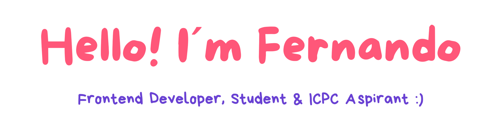

  

## About Me
I am a Computer Science student at the National University of La Plata (UNLP) in Argentina. My focus is on building high-quality frontend experiences where logic and aesthetics meet.

- **Algorithmic Thinking:** I am currently training in data structures and algorithms using C++, preparing for ICPC competitions.
- **Motion & UI:** I specialize in creating fluid, premium interfaces with **React**, using **GSAP** to bring designs to life through advanced animations.
- **Continuous Growth:** I integrate AI tools into my daily workflow to optimize my learning process and code efficiency.

My goal is to achieve academic excellence and eventually pursue a Master's degree at top-tier institutions like MIT.

## Languages and Tools:

  
 

## Contact

  
  

